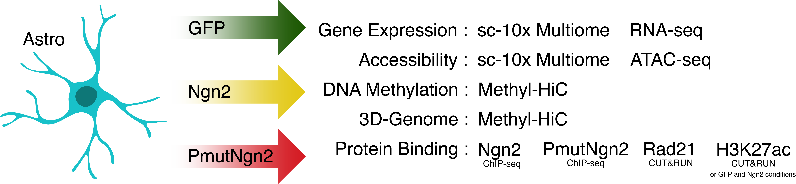

**Direct neuronal reprogramming of mouse astrocytes is associated with multiscale epigenome remodeling and requires Yy1**

Allwyn Pereira^1,2,§^, Jeisimhan Diwakar^1,3,\*^, Giacomo Masserdotti^1,2,\*^, Sude Beşkardeş^1,3^, Tatiana Simon^1,2^, Younju So^1,2^, Lucía Martín-Loarte^1,2^, Franziska Bergemann^1,2^, Lakshmy Vasan^4^, Tamas Schauer^5,°^, Anna Danese^1,2^, Riccardo Bocchi^1,2,+^, Maria Colomé-Tatché^6,7^, Carol Schuurmans^4^, Anna Philpott^8^, Tobias Straub^4^, Boyan Bonev^1,3,#^ & Magdalena Götz^1,2,9,#^

Affiliations

1 Biomedical Center Munich (BMC), Physiological Genomics, LMU Munich, 82152 Planegg-Martinsried, Germany. \
2 Institute of Stem Cell Research, Helmholtz Center Munich, BMC LMU Munich, 82152 Planegg-Martinsried, Germany. \
3 Helmholtz Pioneer Campus, Helmholtz Center Munich, 85764 Neuherberg, Germany. \
4 Biological Science Platform, Sunnybrook Research Institute; Department of Biochemistry, University of Toronto, Toronto, Canada. \
5 Biomedical Center Munich (BMC), Bioinformatic Core Facility, Faculty of Medicine, LMU Munich, 82152 Planegg-Martinsried, Germany. \
6 Institute of Computational Biology, Helmholtz Center Munich, 85764 Neuherberg, Germany. \
7 Biomedical Center Center (BMC), Physiological Chemistry, Faculty of Medicine, LMU Munich, 82152 Planegg-Martinsried, Germany. \
8 Wellcome – Medical Research Council Cambridge Stem Cell Institute, University of Cambridge, Cambridge Biomedical Campus, CB2 0AW, UK. \
9 Excellence Cluster of Systems Neurology (SYNERGY), Munich, Germany. \

\* These authors contributed equally \
\§ present address: University of Nantes, INSERM, UMR 1089, Nantes, France \
\° present address: Institute of Stem Cells and Epigenetics, Helmholtz Center Munich, 85764 Neuherberg, Germany \
\+ present address: Department of Basic Neurosciences, University of Geneva, Geneva, Switzerland. \
\# These authors jointly supervised this work: B. Bonev, M. Götz \

Correspondence to: boyan.bonev@helmholtz-munich.de,
magdalena.goetz@helmholtz-munich.de

**List of Figures**

**•	Fig. 1: PmutNgn2 accelerates mouse astrocyte-to-neuron reprogramming** \
o	Associated with Extended Data Fig. 1 \
  o	Input – Immunostained cells \
  o	Output – Differential reprogramming speeds across conditions \
  
**•	Fig. 2: Gene expression differences elicited by Ngn2 and PmutNgn2** \
o	Associated with Extended Data Fig. 2 \
  o	Input – Single cell multiome and bulk RNA-seq \
  o	Output – Differential gene expression across conditions \
  
**•	Fig. 3: Changes in regulatory landscape caused by Ngn2 or PmutNgn2** \
o	Associated with Extended Data Fig. 3 \
  o	Input – Single cell multiome and bulk ATAC-seq \
  o	Output – Differential accessible peaks across conditions \
  
**•	Fig. 4: Ngn2 or PmutNgn2 differentially bind and remodel chromatin** \
o	Associated with Extended Data Fig. 4 \
  o	Input – ChIP-seq and Cut&Run \
  o	Output – Differentially bound and associated histone peaks \
  
**•	Fig. 5: PmutNgn2 enhances 3D genome and DNA methylation changes** \
o	Associated with Extended Data Fig. 5 \
  o	Input – Methyl-HiC \
  o	Output – Differential chromatin looping and DNA methylation states \
  
**•	Fig. 6: Ngn2 and Yy1 synergize to alter the epigenetic landscape** \
o	Associated with Extended Data Fig. 6 \
  o	Input – Single cell multiome, Cut&Run and Methyl-HiC \
  o	Output – Co-binding and downstream associated effects on accessibility, gene expression and chromatin looping \
  
**•	Fig. 7: Successful murine glia-to-neuron reprogramming requires Yy1** \
o	Associated with Extended Data Fig. 6 \
  o	Input – Immunostaining and scRNA-seq \
  o	Output – Protein depletion effect on reprogramming efficiency and downstream gene expression states \
  
**•	Fig. 8: Yy1 facilitates Ngn2-mediated epigenetic remodeling** \
o	Associated with Extended Data Fig. 7 \
  o	Input – scRNA-seq, Cut&Run and Co-IP \
  o	Output – Protein depletion effect on epigenetic landscape as potential result of protein-protein interaction \ 

•	Extended Data Fig. 1: PmutNgn2 accelerates mouse astrocyte-to-neuron reprogramming \
•	Extended Data Fig. 2: Quality control and comparison of genomic datasets \
•	Extended Data Fig. 3: Chromatin accessibility characteristics of induced neurons \
•	Extended Data Fig. 4: Ngn2 and PmutNgn2 binding remodels chromatin \
•	Extended Data Fig. 5: Ngn2 and PmutNgn2 rewire the 3D genome \
•	Extended Data Fig. 6: Yy1 is required for successful mouse astrocyte-to-neuron conversion \
•	Extended Data Fig. 7: Yy1 deletion impairs Ngn2-mediated chromatin remodelling \
